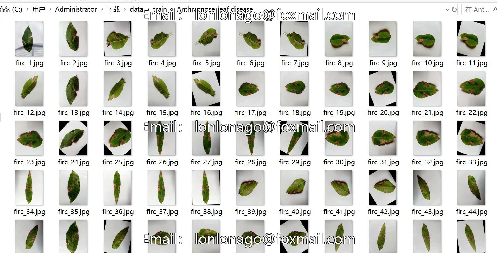
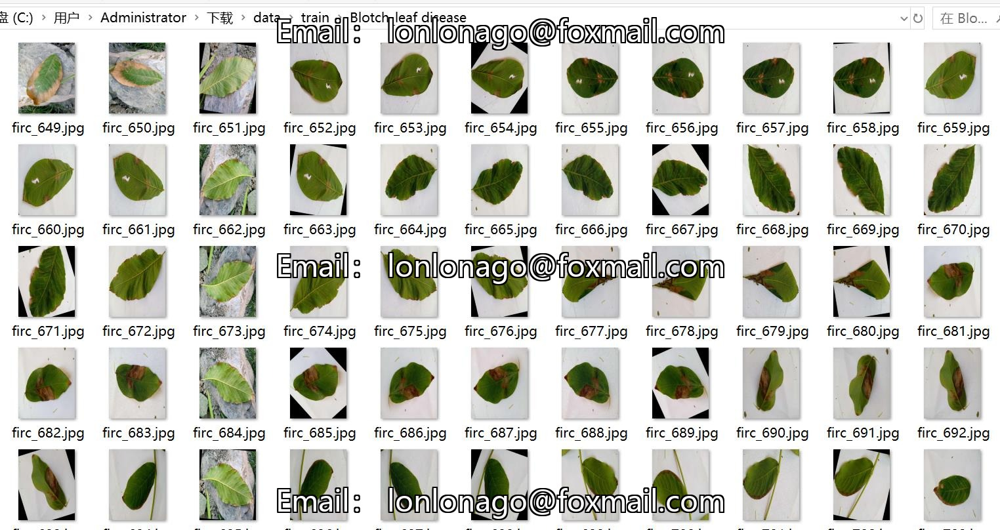
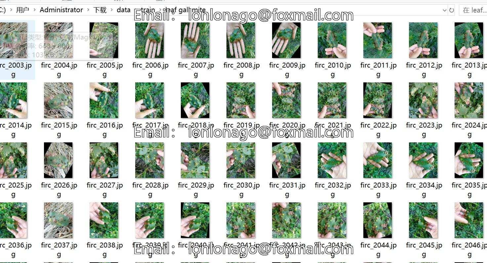
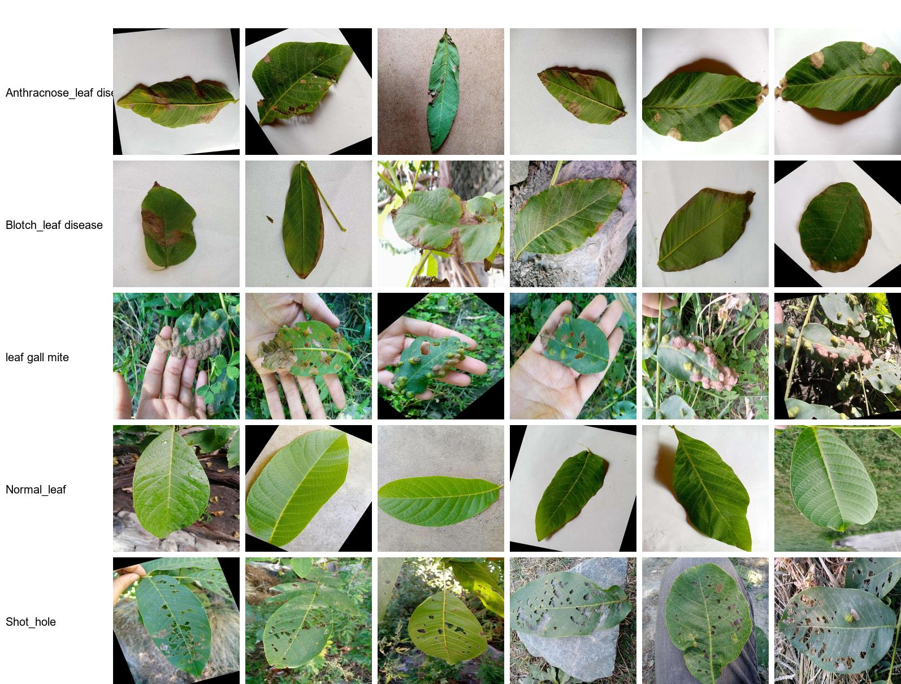

# Walnut Leaf Disease Classification Dataset with 5030 Images in 5 Categories

Dataset type: Image classification
Dataset format: Only contains jpg images, each class file is stored under the corresponding image.
number of images: 5030  
number of classes: 5  
image resolution: 640x800  
category names:['Anthracnose_leaf disease','Blotch_leaf disease','Normal_leaf','Shot_hole','leaf gall mite']  
images per class:   
training set image count: 4022  
training set image count: 4022  
-Anthracnose leaf disease training set image count: 648
- Blotch_leaf disease/patch disease training set image count: 1354
- Leaf gall mite (Leaf galls) training set image count: 392
- Normal_leaf(Normal leaves) training set image count: 712
- Shot_hole(Shot holes) training set image count: 916
validation set image count: 1008  
Anthracnose leaf disease validation set image count: 162
Blotch leaf disease validation set image count: 339
Leaf galling mite validation set image count: 98
Normal leaf validation set image count: 178
Shot hole validation set image count: 231
test set image count: 0  
total images:   
- Anthracnose Leaf Disease: 810 images
- Blotch Leaf Disease: 1693 images
- Leavegaller mite: 490 images
- Normal Leaf: 890 images
- Shot Hole: 1147 images
Important Notes: There are no notes at the moment.
Special Statement: This dataset does not guarantee any accuracy in training models or weight files.
Image Preview:
## Images

Here is a pay link on Stripe ( https://buy.stripe.com/3cs8yP7sY87d0vu9AB ). Please contact me lonlonago@foxmail.com after funding $89, and I will send you a complete data files , thank you!

